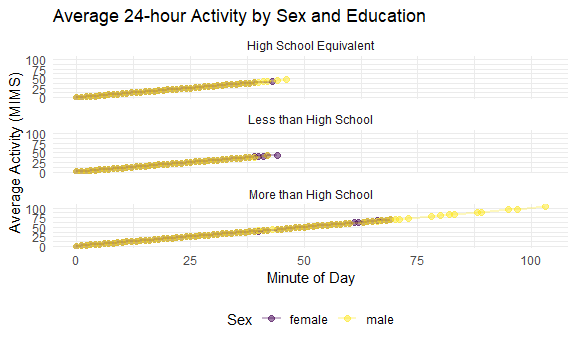

p8105_hw3_csl2209
================
Casandra Laney
2025-10-07

## Problem 1

Load the data

``` r
library(tidyverse)
```

    ## ── Attaching core tidyverse packages ──────────────────────── tidyverse 2.0.0 ──
    ## ✔ dplyr     1.1.4     ✔ readr     2.1.5
    ## ✔ forcats   1.0.0     ✔ stringr   1.5.1
    ## ✔ ggplot2   3.5.2     ✔ tibble    3.3.0
    ## ✔ lubridate 1.9.4     ✔ tidyr     1.3.1
    ## ✔ purrr     1.1.0     
    ## ── Conflicts ────────────────────────────────────────── tidyverse_conflicts() ──
    ## ✖ dplyr::filter() masks stats::filter()
    ## ✖ dplyr::lag()    masks stats::lag()
    ## ℹ Use the conflicted package (<http://conflicted.r-lib.org/>) to force all conflicts to become errors

``` r
knitr::opts_chunk$set(
  fig.width = 6,
  fig.asp = .6,
  out.width = "90%"
)

theme_set(theme_minimal() + theme(legend.position = "bottom"))

options(
  ggplot2.continuous.colour = "viridis",
  ggplot2.continuous.fill = "viridis"
)

scale_colour_discrete = scale_colour_viridis_d
scale_fill_discrete = scale_fill_viridis_d

library(lubridate)
library(patchwork)
library(p8105.datasets)
data("instacart")
```

The dataset ‘instacart’ contains 15 variables of grocery data collected
through the instacart ordering service from June 24, 2017.

Important variables include:

- ‘order_id’: the ID number of the order.

- ‘product_id’: the ID number of the product ordered.

- ‘add_to_cart_order’: the order by which the product was added to the
  cart

- ‘reordered’: whether the customer has ordered the item previously or
  not

- ‘user_id’: the identification number of the user who ordered.

For example, in the first row of data, we see that order 1 contained the
product identified as 49302 one time. This product was reordered once by
user 112108.

``` r
instacart |>
  group_by(aisle) |>
  summarize(n_obs = n()) |>
  arrange(desc(n_obs))
```

    ## # A tibble: 134 × 2
    ##    aisle                          n_obs
    ##    <chr>                          <int>
    ##  1 fresh vegetables              150609
    ##  2 fresh fruits                  150473
    ##  3 packaged vegetables fruits     78493
    ##  4 yogurt                         55240
    ##  5 packaged cheese                41699
    ##  6 water seltzer sparkling water  36617
    ##  7 milk                           32644
    ##  8 chips pretzels                 31269
    ##  9 soy lactosefree                26240
    ## 10 bread                          23635
    ## # ℹ 124 more rows

There are 134 aisles, and the most items are ordered from the ‘fresh
vegetables’ aisle.

``` r
instacart |>
  group_by(aisle) |>
  summarize(n_obs = n()) |>
  filter(n_obs > 10000) |>
  arrange(n_obs) |>
  ggplot(aes(x = reorder(aisle, n_obs), y = n_obs)) +
  geom_col() +
  coord_flip() +
  labs(
    title = "Number of Items Ordered by Aisle (>10,000 Orders)",
    x = "Aisle",
    y = "Number of Items Ordered",
    caption = "Data from the Instacart dataset"
  ) 
```


There are 134 aisles, and the most items are ordered from the ‘fresh
vegetables’ aisle.

Make a table showing the three most popular items in each of the aisles
“baking ingredients”, “dog food care”, and “packaged vegetables fruits”.
Include the number of times each item is ordered in your table.

``` r
instacart |>
  filter(
    aisle == "baking ingredients" |
    aisle == "dog food care" |
    aisle == "packaged vegetables fruits"
  ) |>
  group_by(aisle, product_name) |>
  summarize(n_orders = n()) |>
  arrange(aisle, desc(n_orders)) |>
  mutate(rank = row_number()) |>
  filter(rank <= 3) 
```

    ## `summarise()` has grouped output by 'aisle'. You can override using the
    ## `.groups` argument.

    ## # A tibble: 9 × 4
    ## # Groups:   aisle [3]
    ##   aisle                      product_name                         n_orders  rank
    ##   <chr>                      <chr>                                   <int> <int>
    ## 1 baking ingredients         Light Brown Sugar                         499     1
    ## 2 baking ingredients         Pure Baking Soda                          387     2
    ## 3 baking ingredients         Cane Sugar                                336     3
    ## 4 dog food care              Snack Sticks Chicken & Rice Recipe …       30     1
    ## 5 dog food care              Organix Chicken & Brown Rice Recipe        28     2
    ## 6 dog food care              Small Dog Biscuits                         26     3
    ## 7 packaged vegetables fruits Organic Baby Spinach                     9784     1
    ## 8 packaged vegetables fruits Organic Raspberries                      5546     2
    ## 9 packaged vegetables fruits Organic Blueberries                      4966     3

Make a table showing the mean hour of the day at which Pink Lady Apples
and Coffee Ice Cream are ordered on each day of the week; format this
table for human readers (i.e. produce a 2 x 7 table).

``` r
instacart |>
  filter(product_name == c("Pink Lady Apples", "Coffee Ice Cream")) |>
  group_by(product_name, order_dow) |>
  summarize(mean_hour = mean(order_hour_of_day)) |>
  pivot_wider(
    names_from = order_dow,
    values_from = mean_hour
  )
```

    ## Warning: There was 1 warning in `filter()`.
    ## ℹ In argument: `product_name == c("Pink Lady Apples", "Coffee Ice Cream")`.
    ## Caused by warning in `product_name == c("Pink Lady Apples", "Coffee Ice Cream")`:
    ## ! longer object length is not a multiple of shorter object length

    ## `summarise()` has grouped output by 'product_name'. You can override using the
    ## `.groups` argument.

    ## # A tibble: 2 × 8
    ## # Groups:   product_name [2]
    ##   product_name       `0`   `1`   `2`   `3`   `4`   `5`   `6`
    ##   <chr>            <dbl> <dbl> <dbl> <dbl> <dbl> <dbl> <dbl>
    ## 1 Coffee Ice Cream  13.2  15    15.3  15.4  15.2  10.3  12.4
    ## 2 Pink Lady Apples  12.2  11.7  12    13.9  11.9  13.9  11.6

# Problem 2

Import, clean, and otherwise tidy these datasets.

``` r
zori = read_csv("data/zillow_data/Zip_zori_uc_sfrcondomfr_sm_month_NYC.csv") |>
  janitor::clean_names() |>
  drop_na() |>
  pivot_longer(
    x2015_01_31:x2024_08_31,
    names_to = "date", 
    values_to = "zori"
    ) |>
    mutate(
      date = str_remove(date, "^x"),
      zip_code = as.factor(region_name)) |>
  select(-region_name, -region_type, -state, -city, -state_name, -county_name, -metro)
```

    ## Rows: 149 Columns: 125
    ## ── Column specification ────────────────────────────────────────────────────────
    ## Delimiter: ","
    ## chr   (6): RegionType, StateName, State, City, Metro, CountyName
    ## dbl (119): RegionID, SizeRank, RegionName, 2015-01-31, 2015-02-28, 2015-03-3...
    ## 
    ## ℹ Use `spec()` to retrieve the full column specification for this data.
    ## ℹ Specify the column types or set `show_col_types = FALSE` to quiet this message.

``` r
zip_codes = read_csv("data/zillow_data/Zip Codes.csv") |>
  janitor::clean_names() |>
  mutate(
    zip_code = as.factor(zip_code),
    neighborhood = as.factor(neighborhood),
    ) |>
  select(-file_date)
```

    ## Rows: 322 Columns: 7
    ## ── Column specification ────────────────────────────────────────────────────────
    ## Delimiter: ","
    ## chr (4): County, County Code, File Date, Neighborhood
    ## dbl (3): State FIPS, County FIPS, ZipCode
    ## 
    ## ℹ Use `spec()` to retrieve the full column specification for this data.
    ## ℹ Specify the column types or set `show_col_types = FALSE` to quiet this message.

``` r
tidy_zillow =
  zori |>
  left_join(zip_codes, by = "zip_code") |>
  mutate(
    year = year(ymd(date))) |>
  select(date, zip_code, neighborhood, county, zori, state_fips, county_code, county_fips, region_id, size_rank)
```

    ## Warning in left_join(zori, zip_codes, by = "zip_code"): Detected an unexpected many-to-many relationship between `x` and `y`.
    ## ℹ Row 1277 of `x` matches multiple rows in `y`.
    ## ℹ Row 56 of `y` matches multiple rows in `x`.
    ## ℹ If a many-to-many relationship is expected, set `relationship =
    ##   "many-to-many"` to silence this warning.

There are 116 months between January 2015 and August 2024.

``` r
zip_count =
  tidy_zillow |>
  group_by(zip_code) |>
  summarize(n_months = n())

high_count =
  zip_count |>
  filter(n_months == 116)

low_count =
  zip_count |>
  filter(n_months < 10)
```

- How many ZIP codes are observed 116 times? How many are observed fewer
  than 10 times?

10 ZIP codes are observed 116 times. 0 ZIP codes are observed fewer than
10 times

- Why are some ZIP codes are observed rarely and others observed in each
  month?

The difference comes from how much real estate activity is happening for
that particular ZIP code. Some ZIP codes have more real estate activity
than others.

Create a reader-friendly table showing the average rental price in each
borough and year (not month). Comment on trends in this table.

``` r
tidy_zillow |>
  mutate(date = ymd(date),year = year(date)) |>
  group_by(
    county, year) |>
  summarize(
    avg_rent = mean(zori)) |>
  pivot_wider(
    names_from = year, values_from = avg_rent) |>
  arrange(county)
```

    ## `summarise()` has grouped output by 'county'. You can override using the
    ## `.groups` argument.

    ## # A tibble: 3 × 11
    ## # Groups:   county [3]
    ##   county   `2015` `2016` `2017` `2018` `2019` `2020` `2021` `2022` `2023` `2024`
    ##   <chr>     <dbl>  <dbl>  <dbl>  <dbl>  <dbl>  <dbl>  <dbl>  <dbl>  <dbl>  <dbl>
    ## 1 Kings     2539.  2617.  2659.  2704.  2814.  2787.  2817.  3309.  3496.  3610.
    ## 2 New York  3049.  3092.  3114.  3161.  3251.  3087.  3103.  3709.  3856.  3966.
    ## 3 Queens    2284.  2369.  2399.  2415.  2536.  2519.  2546.  2857.  3052.  3178.

The average rental price in ‘New York’ is consistently greater than the
average rental price for ‘Kings’ and ‘Queens’ across the years.

Make a plot showing NYC Rental Prices within ZIP codes for all available
years. Your plot should facilitate comparisons across boroughs. Comment
on any significant elements of this plot.

``` r
all_years = 
  tidy_zillow |>
  mutate(date = ymd(date)) |>
  ggplot(aes(x = date, y = zori, group = zip_code, color = county)) +
  geom_line() +
  labs(
    title = "NYC Rental Prices by Zip Code (2015-2024))",
    x = "Date",
    y = "Rental Price",
    color = "Borough"
  )  +
  scale_x_date(
    date_breaks = "1 year")

all_years
```


Generally, we see ‘New York’ prices are greater than ‘Queens’ and
‘Kings’ prices. We see a stead increase in rental price over the years,
but from 2021-2022, we see a sizable drop in all zip codes.

Compute the average rental price within each ZIP code over each month in
2023. Make a reader-friendly plot showing the distribution of
ZIP-code-level rental prices across boroughs; put differently, your plot
should facilitate the comparison of the distribution of average rental
prices across boroughs. Comment on this plot.

``` r
average_price =
  tidy_zillow |>
  mutate(date = ymd(date)) |>
  filter(year(date) == 2023) |>
  group_by(zip_code, county, date) |>
  summarize(avg_zori = mean(zori)) |>
  ggplot(aes(x = date, y = avg_zori, group = zip_code, color = county)) +
  geom_line() +
  labs(
    title = "NYC Rental Prices by Zip Code across Boroughs (2023))",
    x = "Month",
    y = "Rental Price",
    color = "Borough"
  )  +
  scale_x_date(
    date_breaks = "1 month",
    date_labels = "%m")
```

    ## `summarise()` has grouped output by 'zip_code', 'county'. You can override
    ## using the `.groups` argument.

``` r
average_price
```


We see that the average rental price stays steady throughout all
boroughs, with a minor increase around August in 2023.

Combine the two previous plots into a single graphic, and export this to
a results folder in your repository.

``` r
combined_plot =
  all_years / average_price + plot_layout(guides = "collect")

ggsave(
  filename = "results/nyc_rental_combined.png",
  plot = combined_plot,
  width = 12,
  height = 10,
  dpi = 300
)
```

# Problem 3

Load, tidy, merge, and otherwise organize the data sets.

``` r
accel = read_csv("data/nhanes_accel.csv", na = c("NA", ".", "")) |>
  janitor::clean_names() |>
  drop_na() |>
  pivot_longer(
    cols = starts_with("min"),
    names_to = "minute",
    names_prefix = "minute_",
    values_to = "MIMS"
  ) |>
  mutate(
    minute = as.integer(MIMS),   # numeric minute
    MIMS = as.numeric(MIMS)        # numeric activity values
  )
```

    ## Rows: 250 Columns: 1441
    ## ── Column specification ────────────────────────────────────────────────────────
    ## Delimiter: ","
    ## dbl (1441): SEQN, min1, min2, min3, min4, min5, min6, min7, min8, min9, min1...
    ## 
    ## ℹ Use `spec()` to retrieve the full column specification for this data.
    ## ℹ Specify the column types or set `show_col_types = FALSE` to quiet this message.

``` r
covar = read_csv("data/nhanes_covar.csv", na = c("NA", ".", ""), skip = 4) |>
  janitor::clean_names() |>
  drop_na() # exclude missing
```

    ## Rows: 250 Columns: 5
    ## ── Column specification ────────────────────────────────────────────────────────
    ## Delimiter: ","
    ## dbl (5): SEQN, sex, age, BMI, education
    ## 
    ## ℹ Use `spec()` to retrieve the full column specification for this data.
    ## ℹ Specify the column types or set `show_col_types = FALSE` to quiet this message.

``` r
accel_combined = 
  accel |>
  left_join(covar, by = "seqn") |> # merge datasets
  select(seqn, sex, age, bmi, education, everything()) |>
  filter(age >= 21) |> # exclude participants less than 21
  mutate( 
    seqn = as.factor(seqn),
    sex = 
      case_match(
        sex,
      1 ~ "male",
      2 ~ "female"
    ),
    education =
      case_match(
        education,
        1 ~ "Less than High School",
        2 ~ "High School Equivalent",
        3 ~ "More than High School"
      ))
```

Produce a reader-friendly table for the number of men and women in each
education category, and create a visualization of the age distributions
for men and women in each education category. Comment on these items.

``` r
accel_combined |>
  filter(sex == c("male", "female")) |>
  group_by(
    education, sex) |>
  summarize(
    count = n()) |>
  pivot_wider(
    names_from = sex, 
    values_from = count)
```

    ## `summarise()` has grouped output by 'education'. You can override using the
    ## `.groups` argument.

    ## # A tibble: 3 × 3
    ## # Groups:   education [3]
    ##   education              female  male
    ##   <chr>                   <int> <int>
    ## 1 High School Equivalent  16560 25200
    ## 2 Less than High School   20160 19440
    ## 3 More than High School   42480 40320

``` r
accel_combined |>
  filter(sex == c("male", "female")) |>
  ggplot(aes(x = age, fill = sex)) +
  geom_histogram(
    position = "dodge", binwidth = 10, alpha = 1) +
  facet_wrap(~education) +
  labs(
    title = "Age Distribution by Sex and Education",
    x = "Age",
    y = "Count",
    fill = "Sex")
```


We see that the ‘more than high school’ population has the overall
greatest amount of engagement across all ages (42480 females and 40320
males), with a peak in females ages 20-30. We also see that ‘high school
equivalent’ and ‘less than high school’ have around similar counts of
participants.

Traditional analyses of accelerometer data focus on the total activity
over the day. Using your tidied dataset, aggregate across minutes to
create a total activity variable for each participant. Plot these total
activities (y-axis) against age (x-axis); your plot should compare men
to women and have separate panels for each education level. Include a
trend line or a smooth to illustrate differences. Comment on your plot.

``` r
accel_combined |>
  group_by(seqn, sex, age, education) |>
  summarize(
    total_mims = sum(MIMS)) |>
  ggplot(aes(x = age, y = total_mims, color = sex)) +
  geom_point(alpha = 0.6) +
  geom_smooth(method = "loess", se = FALSE) +   
  facet_wrap(~education) +                      
  labs(
    title = "Total Daily Activity vs Age by Sex and Education",
    x = "Age (years)",
    y = "Total Daily Activity (MIMS)",
    color = "Sex"
  )
```

    ## `summarise()` has grouped output by 'seqn', 'sex', 'age'. You can override
    ## using the `.groups` argument.
    ## `geom_smooth()` using formula = 'y ~ x'


We see that the total daily activity for females is greater in the ‘more
than high school’ and ‘high school equivalent’ education class. We also
see that there is a steep decline in total daily activity for the ‘less
than high school’ group with the increase in age.

Accelerometer data allows the inspection activity over the course of the
day. Make a three-panel plot that shows the 24-hour activity time
courses for each education level and use color to indicate sex. Describe
in words any patterns or conclusions you can make based on this graph;
including smooth trends may help identify differences.

``` r
accel_combined |>
  group_by(education, sex, minute) |>
  summarize(mean_mims = mean(MIMS)) |>
  ggplot(aes(x = minute, y = mean_mims, color = sex)) +
  geom_point(alpha = .5, size = 2) + geom_line(size = 1, alpha = 0.3) +
  facet_wrap(~education, ncol = 1) +
  labs(
    title = "Average 24-hour Activity by Sex and Education",
    x = "Minute of Day",
    y = "Average Activity (MIMS)",
    color = "Sex"
  )
```

    ## `summarise()` has grouped output by 'education', 'sex'. You can override using
    ## the `.groups` argument.

    ## Warning: Using `size` aesthetic for lines was deprecated in ggplot2 3.4.0.
    ## ℹ Please use `linewidth` instead.
    ## This warning is displayed once every 8 hours.
    ## Call `lifecycle::last_lifecycle_warnings()` to see where this warning was
    ## generated.



We see for all age groups that the total average activity increases
throughout the duration of the day. The ‘more than high school’ group
reaches the highest level of activity, while the ‘high school
equivalent’ and the ‘less than high school’ are slightly lower. The
‘high school equivalent’ and the ‘less than high school’ are quite
similar to one another. There does not appear to be much of a difference
between gender groups.
